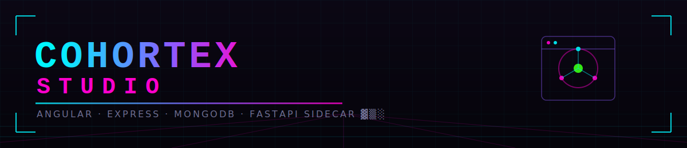
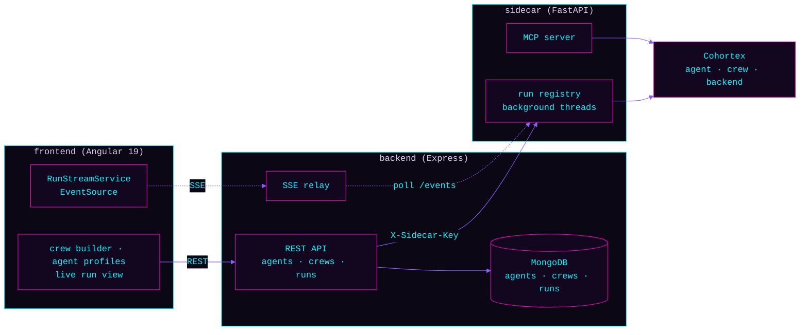

<p align="center">
  
</p>

<p align="center">
  
  
  
  
  
  
</p>

> `// build, run, and watch multi-agent crews from a browser`

A full-stack control panel for [Cohortex](https://github.com/Ninja-Tw1sT/cohortex), the
modular multi-agent framework. Build agent profiles and crews in the UI, launch a run, and
watch each agent's step stream in live over SSE — or replay a pre-recorded run with zero
LLM cost. Three services, one product: **Angular** UI, **Express/MongoDB** API, and a
**FastAPI sidecar** that actually drives the agents.

## Why
Cohortex itself is YAML-and-CLI — great for scripting, opaque for demoing. Cohortex Studio
puts a real UI in front of it: CRUD screens for agents and crews backed by MongoDB, a run
launcher that streams live agent output token-by-token, and a replay mode that lets anyone
click through a recorded multi-agent run without an LLM key or a running Ollama instance.

## Architecture



- **Frontend** — standalone Angular 19 components, no NgModules. `RunStreamService` wraps
  `EventSource` in an RxJS `Observable`, replaying `step`/`done`/`failed` SSE events into
  `NgZone` for change detection.
- **Backend** — Express CRUD for `Agent`/`Crew`/`Run` documents in MongoDB, plus a run
  orchestration layer that either replays a stored run's steps from Mongo (**replay mode**,
  no sidecar call) or starts a real run on the sidecar and relays its polled events as SSE
  (**live mode**).
- **Sidecar** — a thin FastAPI wrapper around Cohortex. Builds a `Crew` from the JSON the
  backend sends, runs it in a background thread, and exposes `/runs/{id}` and
  `/runs/{id}/events` for polling. Also mounts an MCP server so the same crews are reachable
  from any MCP client.

## API surface
```
GET/POST/PUT/DELETE  /api/agents[/:id]
GET/POST/PUT/DELETE  /api/crews[/:id]
POST                 /api/runs            { crewName, task, mode: "live" | "replay" }
GET                  /api/runs
GET                  /api/runs/:id
GET                  /api/runs/:id/stream # SSE: step | done | failed
GET                  /api/health, /api/ping
```

## Quick start
Three services, three terminals. MongoDB and (for live mode) Ollama must already be running.

```bash
# 1. sidecar — wraps Cohortex, runs crews
cd sidecar
python -m venv .venv && .venv/Scripts/activate   # or source .venv/bin/activate
pip install -r requirements.txt
uvicorn app.main:app --reload --port 8000

# 2. backend — REST API + SSE relay
cd backend
npm install
cp .env.example .env       # defaults work for local Mongo + local sidecar
npm run seed                # optional: demo agents/crews + a replay-mode run
npm run dev

# 3. frontend — Angular UI
cd frontend
npm install
npm start                   # ng serve, http://localhost:4200
```

Open `http://localhost:4200`, pick the seeded `research_pipeline` crew, mode **replay**, and
run it to see the full step stream with no LLM calls. Switch to **live** (with Ollama running
and a model pulled) to watch a real crew execute.

## Bring your own key (BYOK)
The public demo at cohortex-studio.web.app runs with `LIVE_RUNS_ENABLED=false` — no LLM
keys on the server, zero ongoing cost. Visitors who want a live run add their own API
credentials in the **LLM Config** page (stored in browser localStorage only), assign one to
each agent in the crew, and the keys are sent per-request to the sidecar, used once, and
never stored in MongoDB or logged anywhere server-side.

## Tool Shed
Agents can call tools beyond Cohortex's two Python builtins (`calculator`, `word_count`) via
**http-kind** catalog entries — a fixed-host URL template (`{input}` allowed only in the
path/query, never the hostname), validated server-side and re-validated at run time
(`cohortex.tools.make_dynamic_tool`) against a private-IP/cloud-metadata blocklist. Three ways
to add one, no code changes required for any of them:
- **Templates** — one click loads a ready-made tool against a well-known, no-key public API
  (Wikipedia summaries, dictionary lookups, public holidays, jokes, cat facts) into the form.
- **Generate with AI** — describe the tool in plain language; your own saved LLM credential
  (BYOK — same per-request, never-persisted key handling as a live run) proposes a name,
  method, URL template, and headers, which you review and edit before saving.
- **Manual entry** — fill in the form yourself.
All three just pre-fill the same form — Save always goes through the same validation, so a
generated or templated proposal gets no more trust than one typed by hand.

## Token efficiency
Every LLM backend captures per-call token usage, which flows through the step events into the
live run view as per-step and total token counts. Sequential crews support `maxHandoffChars` to
truncate inter-agent context and bound token growth. The Anthropic backend uses prompt caching
(`cache_control: ephemeral`) so supervisor loops avoid re-tokenizing the same system prompt.
Completed runs are summarized and stored as "run memories" — the last 3 are injected as context
for future runs on the same crew, enabling cross-run learning without replaying full transcripts.

## Security
No secrets in code or config. Backend and sidecar each read their own gitignored `.env`
(`backend/.env.example`, `sidecar/.env.example`). The sidecar accepts an optional
`SIDECAR_SHARED_KEY` — when set, every sidecar request must carry a matching `X-Sidecar-Key`
header (the backend already sends this header unconditionally); leave it unset for local dev
where the sidecar isn't reachable from outside your machine. Cloud LLM provider keys
(`OPENAI_API_KEY`, `ANTHROPIC_API_KEY`, `GEMINI_API_KEY`, `XAI_API_KEY`) are optional — Ollama
needs none.

## Convenience
Every catalog entry (agent, crew) supports **Export** (downloads a sanitized JSON file — no
`id`/`ownerId`/timestamps, safe to hand to someone else), **Import** (loads a JSON file into the
form for review before saving — never auto-saves), and **Clone** (pre-fills the form from an
existing entry with `_copy` appended to the name). All three just populate the same form Save
already validates, so nothing skips normal validation. Destructive actions (delete) require a
confirmation dialog.

## Testing
```bash
cd frontend && npm test     # Karma/Jasmine
cd backend  && npm test     # Jest + mongodb-memory-server
cd sidecar  && pytest       # FastAPI TestClient, fake Cohortex backend
```

## Roadmap
- [x] **Auth** — Firebase Auth + backend middleware, scoping data to signed-in users
- [x] **Deploy** — Firebase Hosting + Cloud Run + Atlas ($0/month free tier)
- [x] **BYOK** — per-agent visitor-supplied LLM credentials (never persisted)
- [x] **Token accounting** — per-step and total usage in the live run view
- [x] **Context truncation** — `maxHandoffChars` bounds inter-agent context in sequential crews
- [x] **Prompt caching** — Anthropic `cache_control` for supervisor loop efficiency
- [x] **Run memory** — cross-run learning via MongoDB-backed summaries
- [x] **CI** — GitHub Actions running all three test suites on push

## License
MIT © Ryan Seibert.
