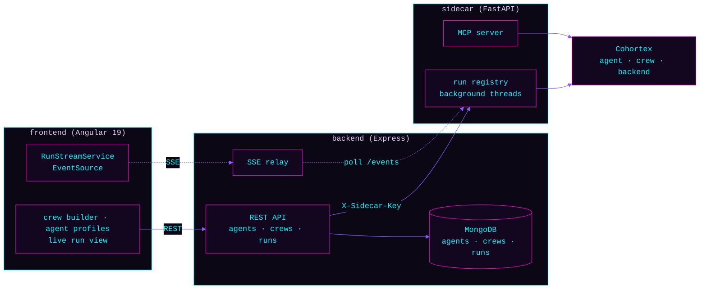

<p align="center">
  
</p>

<p align="center">
  
  
  
  
  
</p>

> `// build, run, and watch multi-agent crews from a browser`

A full-stack control panel for [Cohortex](https://github.com/Ninja-Tw1sT/cohortex), the
modular multi-agent framework. Build agent profiles and crews in the UI, launch a run, and
watch each agent's step stream in live over SSE — or replay a pre-recorded run with zero
LLM cost. Three services, one product: **Angular** UI, **Express/MongoDB** API, and a
**FastAPI sidecar** that actually drives the agents.

## Why
Cohortex itself is YAML-and-CLI — great for scripting, opaque for demoing. Cohortex Studio
puts a real UI in front of it: CRUD screens for agents and crews backed by MongoDB, a run
launcher that streams live agent output token-by-token, and a replay mode that lets anyone
click through a recorded multi-agent run without an LLM key or a running Ollama instance.

## Architecture



- **Frontend** — standalone Angular 19 components, no NgModules. `RunStreamService` wraps
  `EventSource` in an RxJS `Observable`, replaying `step`/`done`/`failed` SSE events into
  `NgZone` for change detection.
- **Backend** — Express CRUD for `Agent`/`Crew`/`Run` documents in MongoDB, plus a run
  orchestration layer that either replays a stored run's steps from Mongo (**replay mode**,
  no sidecar call) or starts a real run on the sidecar and relays its polled events as SSE
  (**live mode**).
- **Sidecar** — a thin FastAPI wrapper around Cohortex. Builds a `Crew` from the JSON the
  backend sends, runs it in a background thread, and exposes `/runs/{id}` and
  `/runs/{id}/events` for polling. Also mounts an MCP server so the same crews are reachable
  from any MCP client.

## API surface
```
GET/POST/PUT/DELETE  /api/agents[/:id]
GET/POST/PUT/DELETE  /api/crews[/:id]
POST                 /api/runs            { crewName, task, mode: "live" | "replay" }
GET                  /api/runs
GET                  /api/runs/:id
GET                  /api/runs/:id/stream # SSE: step | done | failed
GET                  /api/health, /api/ping
```

## Quick start
Three services, three terminals. MongoDB and (for live mode) Ollama must already be running.

```bash
# 1. sidecar — wraps Cohortex, runs crews
cd sidecar
python -m venv .venv && .venv/Scripts/activate   # or source .venv/bin/activate
pip install -r requirements.txt
uvicorn app.main:app --reload --port 8000

# 2. backend — REST API + SSE relay
cd backend
npm install
cp .env.example .env       # defaults work for local Mongo + local sidecar
npm run seed                # optional: demo agents/crews + a replay-mode run
npm run dev

# 3. frontend — Angular UI
cd frontend
npm install
npm start                   # ng serve, http://localhost:4200
```

Open `http://localhost:4200`, pick the seeded `research_pipeline` crew, mode **replay**, and
run it to see the full step stream with no LLM calls. Switch to **live** (with Ollama running
and a model pulled) to watch a real crew execute.

## Security
No secrets in code or config. Backend and sidecar each read their own gitignored `.env`
(`backend/.env.example`, `sidecar/.env.example`). The sidecar accepts an optional
`SIDECAR_SHARED_KEY` — when set, every sidecar request must carry a matching `X-Sidecar-Key`
header (the backend already sends this header unconditionally); leave it unset for local dev
where the sidecar isn't reachable from outside your machine. Cloud LLM provider keys
(`OPENAI_API_KEY`, `ANTHROPIC_API_KEY`, `GEMINI_API_KEY`, `XAI_API_KEY`) are optional — Ollama
needs none.

## Testing
```bash
cd frontend && npm test     # Karma/Jasmine
cd backend  && npm test     # Jest + mongodb-memory-server
cd sidecar  && pytest       # FastAPI TestClient, fake Cohortex backend
```

## Roadmap
- **Auth** — Firebase Auth on the frontend + backend middleware, scoping agents/crews/runs
  to a signed-in user instead of the shared demo namespace (`ownerId: null`).
- **Deploy** — Firebase Hosting (frontend), Cloud Run (backend + sidecar), Atlas (MongoDB).

## License
MIT © Ryan Seibert.
